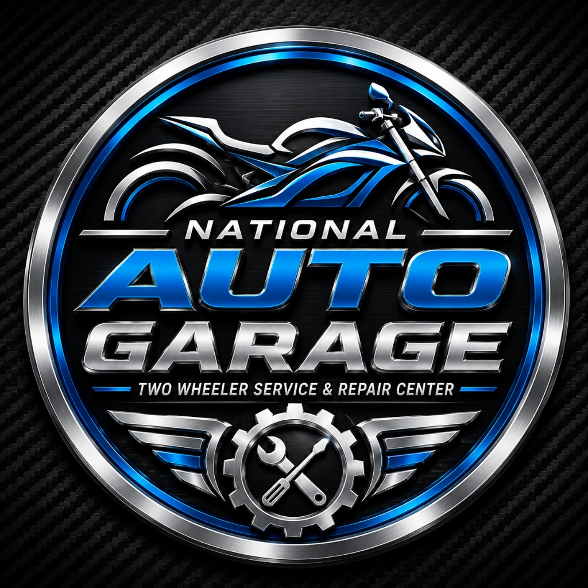

# 🏍️ National Auto Garage — Management System & 3D Web Portal

<p align="center">
  
</p>

<h3 align="center">
  Premier Two-Wheeler Workshop Management System & Public Website
</h3>

<p align="center">
  <strong>Master Mechanics:</strong> Imran Pathan (+91 96248 44188) & Naim Pathan (+91 81281 44350)<br/>
  <strong>Location:</strong> Near White House Petrol Pump, Mosali Chowkdi, Mosali, Taluka: Mangrol, Dist: Surat, Gujarat - 394421
</p>

<p align="center">
  
  
  
  
  
  
  
</p>

---

## 📌 Project Overview

**National Auto Garage** is an end-to-end, ultra-modern, high-performance web application designed for a premier two-wheeler workshop in Mosali, Gujarat. It features an **ultra-luxury public customer portal** with custom 3D graphic service cards, real-time vehicle repair tracking, online booking, and a **comprehensive workshop management ERP** for billing, inventory, job cards, partner settlement, and customer khata management.

---

## ✨ Key Public Website Features

- 🎨 **Ultra-Luxury 3D Service Cards**:
  - 6 Unified White-Left 3D Graphic Cards featuring custom high-resolution equipment graphics and 100% uncut National Auto Garage metallic branding.
  - **Full Bike Service**: 3D Sports Touring Bike on Hydraulic Lift with Mechanic Tool Chest.
  - **Engine Repair & Tuning**: 3D Engine Block Assembly with Pistons, Gears, Torque Wrench, and Feeler Gauge.
  - **Brakes & Shocker Service**: 3D Dual Disc Rotors, Calipers, Inverted Shockers, and Bleeder Bottle.
  - **Wiring & Battery Check**: 3D Battery, Wiring Harness, Diagnostic Screen, and Multimeter.
  - **Chain & Gear System**: 3D Drive Chain Loop, Rear Sprocket, and Bearing Assembly.
  - **Original Spare Parts**: 3D OEM Parts Boxes, Filters, Spark Plugs, and Inventory Monitor.

- 📱 **VisionOS / iOS 18 Interactive Stacked Decks**:
  - Mobile screens feature smooth 3D stacked card deck layers with tap-to-cycle navigation, swipe gestures, and pagination.

- 🔍 **Live Bike Repair Status Tracking**:
  - Customers can enter their vehicle registration number or 10-digit mobile number to track real-time repair progress across 4 stages (*Vehicle Received ➔ Repair In Progress ➔ Ready for Delivery ➔ Delivered*).

- 📞 **Direct Contact Integration**:
  - Direct 1-click Call buttons for master mechanics **Imran Pathan** (`+91 96248 44188`) and **Naim Pathan** (`+91 81281 44350`).
  - Instant WhatsApp Inquiry & Appointment Booking integration.

---

## 🏢 Core Admin ERP & Management Modules

1. 🎨 **Nordic Blue Theme & Uniform Design System**:
   - Unified color tokens (`#0284C7` Ocean Blue Primary, `#7DD3FC` Light Sky Accent, `#0F172A` Deep Slate Sidebar).
   - Uniform container sizing (`max-w-7xl w-full mx-auto`) and white glass header containers across 100% of admin pages.

2. 📊 **Operational Dashboard (`/dashboard`)**:
   - Real-time KPI metrics for Total Revenue, Active Job Cards, Low Stock Alerts, and Outstanding Dues.

3. 📦 **Products & Inventory Management (`/inventory`)**:
   - Spare parts & oil stock catalog, SKU/OEM tracking, MRP vs Cost prices, double-entry stock movement ledger, and negative stock protection.

4. 🚚 **Suppliers & Purchase Orders (`/suppliers` & `/supplier-orders`)**:
   - Vendor directory with shop details and GSTIN, plus purchase order generation with **WhatsApp 1-Click Send Integration**.

5. 🔧 **Service Job Cards (`/jobs/full-service` & `/jobs/engine-job`)**:
   - Full Service and heavy Engine Repair job cards with customer complaints, mechanic assignments, labour charges, and automatic parts deduction.

6. 📄 **Bills & Invoices (`/invoices`)**:
   - GST/Non-GST invoices (`INV-2026-0001`) with automated subtotal, discount, tax calculations, and print-ready/WhatsApp PDF export.

7. 💳 **Customer Khata / Dues Register (`/outstanding`)**:
   - Standalone customer receivables register with partial payment settlement and balance due tracking.

8. 🧾 **Operating Expenses (`/expenses`)**:
   - Expense tracking with 3-Account Ledger Math (*Garage Account*, *Imran Pathan Account*, *Naim Pathan Account*).

9. 🧮 **Live Partner Settlement Calculator (`/calculator`)**:
   - Live 50/50 Partner Equity Profit & Advance Draw Calculator with net payout breakdown for **Naim Pathan** & **Imran Pathan**.

10. 🏷️ **Smart Keywords & Typo-Tolerant Auto-Suggestions (`/keywords`)**:
    - Global master keyword management with typo-tolerant fuzzy auto-suggestions (*tayer* ➔ **Tyre**, *brek* ➔ **Brake Pad**, *oil* ➔ **Engine Oil**) across all input fields.

---

## 🗄️ Database Architecture

Lightweight & optimized MongoDB models:

| Model | Purpose |
| :--- | :--- |
| **`User`** | Admin authentication & bcrypt password verification |
| **`Customer`** | Customer profiles with normalized 10-digit mobile numbers |
| **`Vehicle`** | Two-wheeler records with normalized registration numbers |
| **`Product` / `Part`** | Spare parts & oil stock catalog with MRP and cost prices |
| **`InventoryMovement`** | Immutable stock ledger movement records |
| **`Supplier`** | Vendor contact directory and GSTIN |
| **`SupplierOrder`** | Spare part purchase orders |
| **`ServiceJob`** | Service & Engine Repair job card records |
| **`Bill`** | Customer invoice snapshot & payment status |
| **`Payment`** | Customer payment receipts register |
| **`Expense`** | Garage operating expenses & 3-account ledger attribution |
| **`CustomerOutstanding`** | Standalone customer khata dues register |
| **`MasterKeyword`** | Global auto-suggestion keywords list |
| **`Settings`** | Garage branding, prefixes, and GST configuration |
| **`Employee`** | Mechanics & technician staff register |
| **`ServiceType`** | Standard service rates catalog |
| **`Counter`** | Sequential ID generator (`CUST-`, `JOB-`, `INV-`, `EXP-`, `DUE-`) |

---

## 🛠️ Technology Stack

- **Frontend**: React 18, Vite 6, Tailwind CSS, Lucide React, HTML2Canvas / JSPDF
- **Backend**: Node.js, Express.js, Mongoose, MongoDB, Zod Validation, Bcrypt.js, JsonWebToken
- **Testing**: Node Test Runner (`37 / 37 Automated Tests PASSED`)

---

## 🚀 How to Run Locally

### 1. Start Backend API Server
```bash
cd backend
npm install
npm run dev
```

### 2. Start Frontend Application
```bash
cd frontend
npm install
npm run dev
```

### 3. Run Automated Test Suite
```bash
cd backend
npm test
```

---

## 📍 Workshop Location & Contact

- **Garage Name**: National Auto Garage
- **Master Mechanics**: Imran Pathan & Naim Pathan
- **Contact Numbers**: 
  - Imran Pathan: [`+91 96248 44188`](tel:+919624844188)
  - Naim Pathan: [`+91 81281 44350`](tel:+918128144350)
- **Address**: Near White House Petrol Pump, Mosali Chowkdi, Mosali, Taluka: Mangrol, Dist: Surat, Gujarat – 394421
- **Developer**: [Maaz Pathan](https://www.linkedin.com/in/maazpathan07)

---

<p align="center">
  © 2026 National Auto Garage. All rights reserved.
</p>
